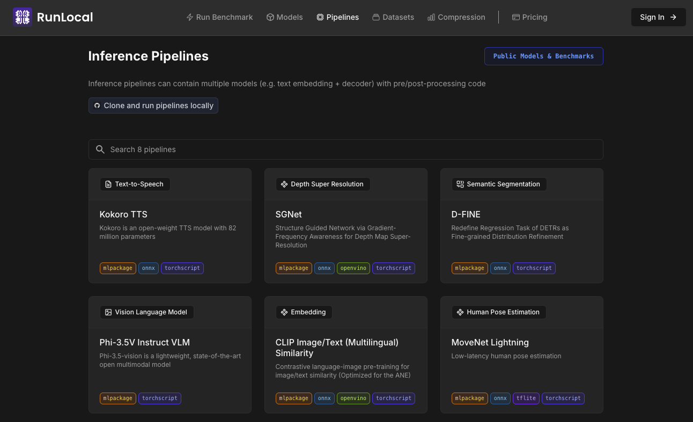

<div align="center">
  
  <br>
  <a href="https://www.runlocal.ai/">www.runlocal.ai</a>
  <br><br>
</div>

# Model Inference Pipelines

This repo contains inference pipelines for the on-device models we've converted to formats like Core ML, ONNX, TFLite and OpenVINO.

For more context on the pipelines, including the specific models being used and their performance benchmarks, please visit [our product](https://edgemeter.runlocal.ai/public/pipelines).

<div align="center">
  
</div>

## Setup

Before running a pipeline, make sure you've installed the base dependencies listed in the root `requirements.txt`:

```bash
python -m venv .venv 
pip install -r requirements.txt
source .venv/bin/activate
```

## Pipelines

Each sub-directory within `inference_pipelines/` contains a specific model pipeline, including:

*   A Python demo script (`*_demo.py`).
*   A `README.md` with instructions on downloading models and running the demo.
*   A pipeline-specific `requirements.txt` for necessary Python dependencies (install **after** the root requirements).

Explore the sub-directories to find specific examples like:

*   Depth Estimation (`depth_anything_v2`)
*   Multimodal Language Models (`phi3_5v_instruct`)
*   Text-to-Speech (`kokoro`)
*   And more!

*Note: Model files are typically large and are not included directly in the repository. Download links are provided in the respective README files.*


